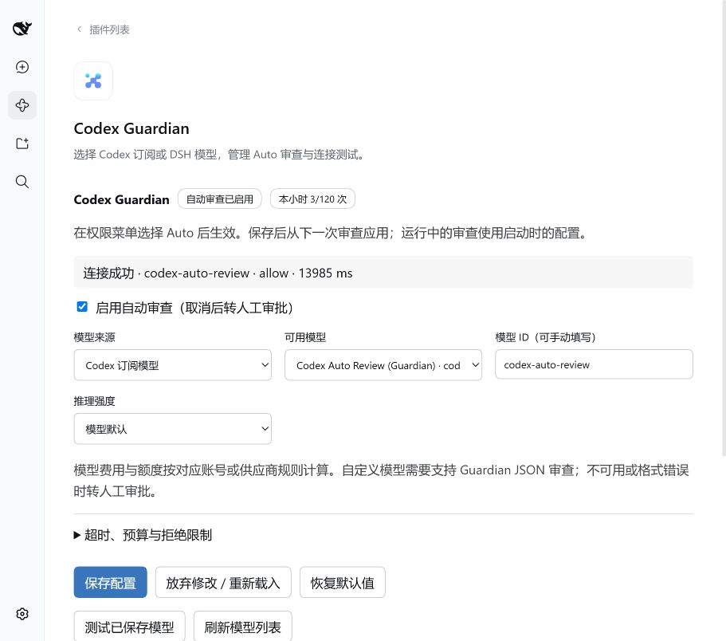

# 0.3.1 模型选择、插件控制页与第三方分类验证

2026-10-06 至 2026-10-07。先在工作区隔离配置验证，随后经用户授权安装到正式 DSH profile，并迁移为已安装第三方 bundle。凭据、官方插件和订阅插件的源码未修改。

## 自动验证

`npm test`：44 项测试通过；`npm run test:legacy`：20 项历史回归通过。

新增覆盖：可编辑配置白名单/范围、配置持久化、无效存储回退、冲突拒绝、写入失败不发布新配置、审查历史的隐私与 200 条上限、动态预算、暂停后转人工、运行中请求保留配置快照、DSH 正常流结束/工具调用拒绝/冲突判定、Codex 自定义模型和推理强度、空模型目录的供应商保留。

## 实际宿主和页面

测试使用安装的桌面 **0.2.0-rc.2** 原版运行时。为绕过本机 Electron Node 模式直接加载 ASAR 时异常退出，`test/extract-runtime.cjs` 将运行时及其原生依赖只读复制到工作区 `.dsh-guardian-runtime`，不修改程序安装目录。使用 Node 22.19.0 和原版 `loadProfileDirectory` / `runProfile` 启动同样的 desktop profile；状态在 `.dsh-guardian-ui`，端口 19389。

`test/ui-bootstrap.cjs --mount-check` 对实际生产 `apply()` 和真实 Cordis fiber 验证：

```text
[guardian-mount] shipped codex-guardian fiber=ACTIVE; Auto registered
[guardian-mount] shipped plugin fiber disposal restored workspace-write and removed Auto; PASS
```

0.3.0 浏览器操作进入真实 DSH **插件 → Codex Guardian**，未创建单独的 mock 页面。页面通过宿主 React、客户端模块资源和认证 Connection RPC 加载；0.3.1 将页面从 `plugins.item`（宿主固定归类到“官方”）迁移到 `plugins.bundle.config`，并补充 `locale/en.json`、`locale/zh.json`，由宿主按已安装第三方 bundle 展示。

已实际验证：

- 默认 Guardian 与 Codex 缓存模型目录显示；手动模型 ID 表单。
- DSH 供应商 `deepseek-official` 和 `deepseek-flash` / `deepseek-v4-pro` 模型显示。
- 保存 DSH 路由，配置落盘；连接测试返回 `deepseek-flash / allow / 3292 ms`。
- 保存自选 Codex 路由；连接测试返回 `gpt-6-luna / deny / 4855 ms`。合成测试收到允许或拒绝均代表模型连接和输出解析成功，不代表准确率。
- 取消“启用自动审查”并保存，显示“已暂停 · 转人工审批”。
- 恢复默认只更新草稿；放弃修改恢复已保存的模型和暂停状态。
- 保存恢复后的 Guardian 默认值；连接测试返回 `codex-auto-review / allow / 13985 ms`。
- 每次连接测试增加共享预算；全部待审命令只是请求字符串，没有执行。
- 重启宿主后恢复已保存配置；预算按实例重新计数。
- 两个真实控制页同时编辑，在第二页保存后，第一页面的旧草稿即使经过状态轮询仍被拒绝，显示配置冲突；重新载入恢复新配置。
- 刷新模型列表，页面反馈 `Codex: live · DSH: available`，保留当前选择。

模型目录刷新请求和缓存回退均有实现；账号未列出或拒绝的模型不会自动切换到其他模型。

正式 profile 迁移验证：Guardian 0.3.1 目录安装到 `C:/Users/15185/.dsh/plugins/dsh-plugin-codex-guardian/0.3.1`，profile 通过 dependency、bundle 和 junction 注册；迁移前已有的其他 profile patch 行逐项保持不变，只把 Guardian 的源码直插行替换成 bundle 配置。旧配置保存为 `cordis.patch.yml.bak-guardian-managed-*` 与 `package.json.bak-guardian-managed-*`。

2026-10-07，正式桌面重启后，通过其端口 19387 的认证浏览器界面确认：

- Guardian 卡片位于“已安装”区域，官方区域中没有 Guardian；卡片启用开关已开启。
- 从卡片打开详情页，显示版本 **0.3.1**、第三方插件说明及卸载入口。
- 原生插件控制页正常渲染，已保存来源为 Codex、模型为 `codex-auto-review`，自动审查已启用。
- “包含的组件”显示 `codex-guardian` / `dsh-plugin-codex-guardian`，共 1 个组件、1 个运行中。
- 浏览器刷新后的错误和警告日志为空。分类截图保留在本机验证产物中；其中包含其他已安装插件的信息，不随仓库发布。



## 产物和限制

配置：`$DSH_HOME/guardian/settings.json`；审查元数据：同目录 `reviews.json`。控制页不接收/返回 token、认证文件内容、策略文件内容或待审参数。敏感宿主配置不开放给页面编辑。

0.2.0 的实际 ToolRuntime/PTC/人工审批执行链证据保留在 `REPLACEMENT-VERIFICATION.md`。本轮是在原版桌面 profile 的浏览器界面进行控制页验证，没有点击 Electron 窗口里的人工批准按钮；原生桌面窗口内的布局可能受窗口大小影响。

Codex 普通订阅模型的费用/额度遵循账号规则，DSH 模型遵循供应商规则；第三方直连 Guardian 是否免费未确认。模型识别/输出能力不同，格式错误、不可用、超时和不合策略的允许结果都会回退人工。
